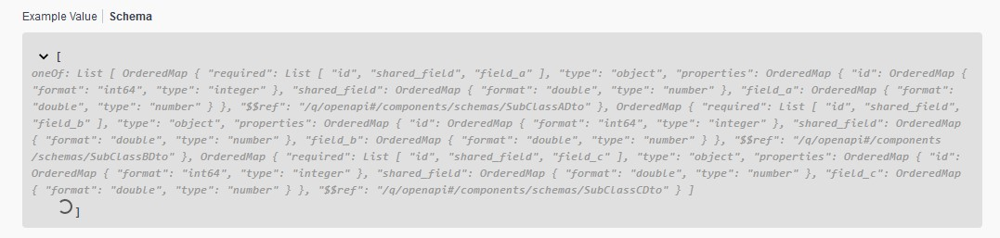

# quarkus-microprofile-openapi-bug-reproducer

## Steps to Reproduce Bug

1. Run `./mvnw compile quarkus:dev`
1. Go to http://localhost:8080/q/swagger-ui.
1. Observe that the response types for both endpoints do not contain an example, and when hitting the schema button, Swagger is not able to process the OpenAPI specification.

1. Go to http://localhost:8080/q/openapi and download the specification.
1. The OpenAPI specification should contain the two following responses.
```yaml
# ... (Omitted for brevity)
      responses:
        "200":
          description: OK
          content:
            application/json:
              schema:
                type: array
                anyOf:
                - $ref: '#/components/schemas/SubClassADto'
                - $ref: '#/components/schemas/SubClassBDto'
                - $ref: '#/components/schemas/SubClassCDto'
# ... (Omitted for brevity)
      responses:
        "200":
          description: OK
          content:
            application/json:
              schema:
                type: array
                oneOf:
                - $ref: '#/components/schemas/SubClassADto'
                - $ref: '#/components/schemas/SubClassBDto'
                - $ref: '#/components/schemas/SubClassCDto'
# ... (Omitted for brevity)
```
## Expected Value
```yaml
# ... (Omitted for brevity)
      responses:
        "200":
          description: OK
          content:
            application/json:
              schema:
                type: array
                items:
                  anyOf:
                  - $ref: '#/components/schemas/SubClassADto'
                  - $ref: '#/components/schemas/SubClassBDto'
                  - $ref: '#/components/schemas/SubClassCDto'
# ... (Omitted for brevity)
      responses:
        "200":
          description: OK
          content:
            application/json:
              schema:
                type: array
                items:
                  oneOf:
                  - $ref: '#/components/schemas/SubClassADto'
                  - $ref: '#/components/schemas/SubClassBDto'
                  - $ref: '#/components/schemas/SubClassCDto'
# ... (Omitted for brevity)
```